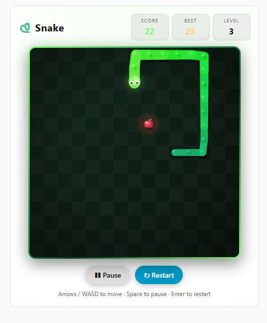

# Snake Game Card for Home Assistant


A fun and interactive Snake game card for Home Assistant.

<p align="center">
  
</p>

## 🎮 Features
- **Classic Snake Gameplay**: Guide the snake to eat food and grow
- **Responsive Design**: Works on desktop and mobile devices
- **Home Assistant Theming**: Automatically adapts to your HA theme
- **Progressive Difficulty**: Game speeds up as you score points
- **Rich Graphics**: Smooth animated snake with gradient body, eyes, blinking and tongue, shiny apples, rotating bonus stars
- **Visual Effects**: Particle bursts, floating score popups, level-up banner, screen shake on crash
- **Score / Best / Level**: High score is saved in the browser
- **Bonus Food**: Every 5 apples a golden star appears for a few seconds (+5 points)
- **Mobile Friendly**: Swipe on the board or use the on-screen D-pad

## 🚀 Installation

### Method 1: HACS (Recommended)
1. Open **HACS** in your Home Assistant
2. Click on the **three dots** in the top right corner
3. Select **Custom repositories**
4. Add this repository URL: `https://github.com/joshuaaaaa/snake_game`
5. Select category: **Dashboard**
6. Click **Add**
7. Find **Snake Card** in HACS and click **Download**
8. Restart Home Assistant
9. Add the following to your Lovelace resources:

```yaml
resources:
  - url: /hacsfiles/snake_game/snake_game.js
    type: module
```

### Method 2: Manual Installation
1. Download the [`snake_game.js`](dist/snake_game.js) file
2. Create a `snake_game` folder in your `config/www/` directory
3. Place the `snake_game.js` file in `config/www/snake_game/`
4. Add the following to your Lovelace resources:

```yaml
resources:
  - url: /local/snake_game/snake_game.js
    type: module
```

5. Restart Home Assistant

## 📋 Configuration

Add the card to your Lovelace dashboard:

**Via UI:**
1. Edit your dashboard
2. Click **Add Card**
3. Scroll down to **Custom Cards**
4. Select **Snake Card**

**Via YAML:**
```yaml
type: custom:snake-card
```

Optional settings:
```yaml
type: custom:snake-card
title: Snake        # card title
grid_size: 15       # board size (8–30 cells)
```

## ⌨️ Controls
- **Arrow Keys / WASD**: Control snake direction (↑ ↓ ← →)
- **Space / P**: Pause / resume
- **Enter**: Play again after game over
- **Touch**: Swipe on the board, tap to start/pause, or use the D-pad
- **Restart Button**: Reset the game

## 🎯 How to Play
1. Press an arrow key (or tap the board) to start, then steer the snake
2. Eat the apples to grow, grab golden stars for bonus points
3. Avoid hitting the walls and yourself
4. Try to beat your high score!

## 📄 License
This project is licensed under the **MIT License**.

Enjoy playing Snake in Home Assistant! 🐍✨

## Support
If you like this card, please ⭐ star this repository!

Found a bug or have a feature request? Please open an issue.

## ☕ Buy me a coffee
<a href="https://buymeacoffee.com/jakubhruby">
  
</a>
